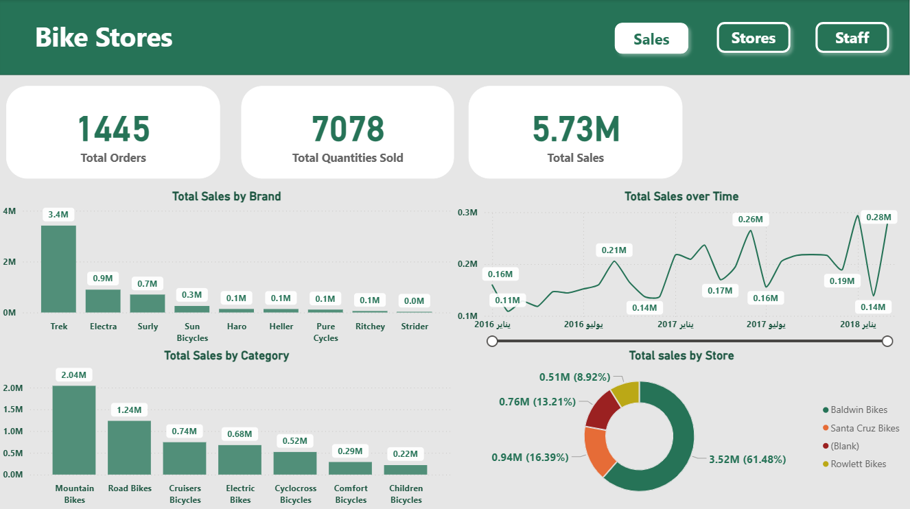
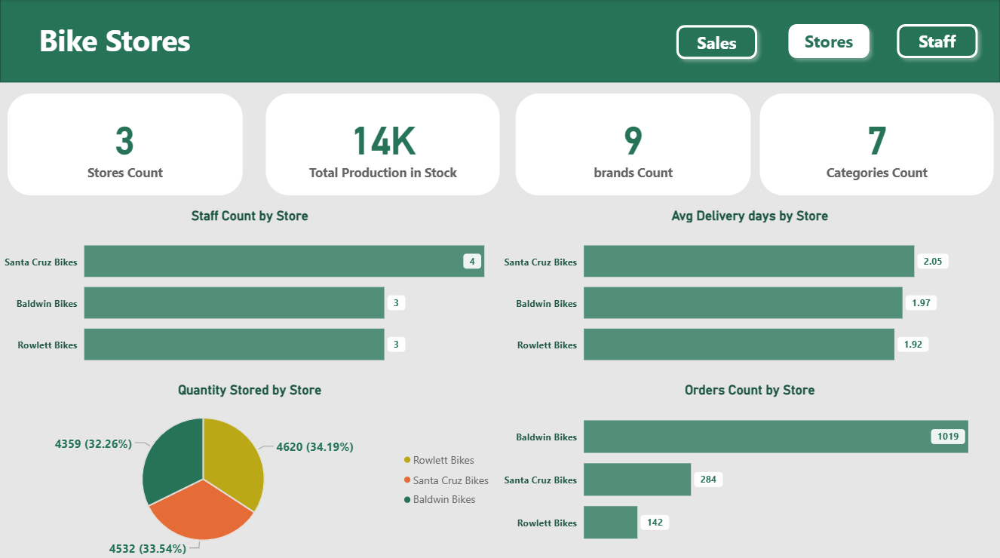
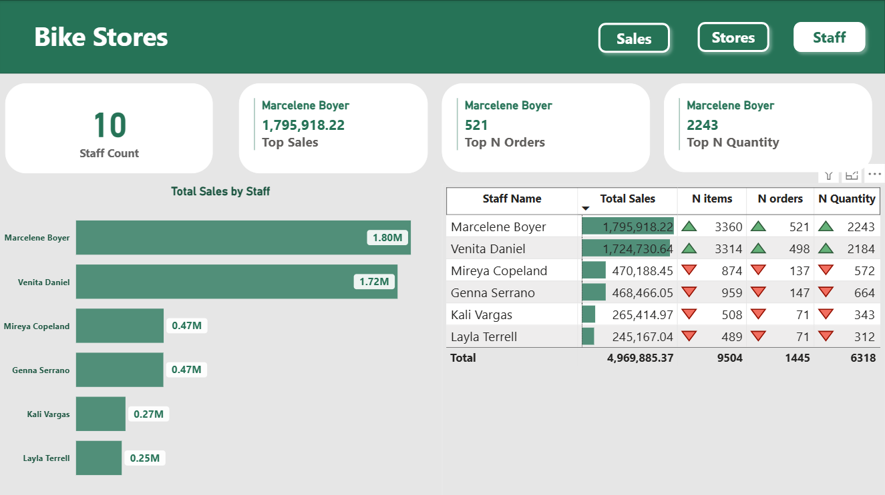

# 🚴‍♂️ BikeStores Analysis Project

This project focuses on analyzing the **BikeStores** sample database using **SQL** for data exploration and preprocessing, and **Power BI** for interactive visualization.

The goal is to uncover insights about sales, customers, staff, and stores, and then present them in a clean, easy-to-understand dashboard.

---

## 📂 Project Structure

* **Task 1 – SQL Analysis**
  Performed queries to explore and analyze the BikeStores database. Key insights include:

  * Average list price by **Brand** and **Category**
  * Quantity of products stored in each store
  * Number of customers and stores
  * Delivery performance (average shipping days)
  * Number of staff per store
  * Total sales per **store** and per **staff**
  * Top 10 customers by purchase value

* **Task 2 – Power BI Dashboard**
  Created a 3-page Power BI dashboard for visualization:

  1. **Sales Page** – Highlights sales performance, customer purchases, and revenue trends.
  2. **Stores Page** – Compares stores in terms of sales, staff count, and inventory.
  3. **Staff Page** – Shows staff contributions to overall sales performance.

---

## 🛠️ Tools & Technologies

* **SQL Server** → for querying and analyzing raw data
* **Power BI** → for creating dashboards and interactive reports

---

## 🖼️ Dashboard Preview

Below are sample screenshots of the Power BI dashboard:

* **Sales Dashboard**
  

* **Stores Dashboard**
  

* **Staff Dashboard**
  

---

## 🖼️ SQL Queries

Below are sample screenshots of SQL Queries:

  .png)
  .png)
  .png)
  .png)
  .png)
  .png)
  .png)
  .png)
  .png)
  .png)
  .png)
  .png)

---

## 📌 Conclusion

This project demonstrates:

* How **SQL** can be used for data exploration and business insights.
* How **Power BI** can visualize raw data into interactive dashboards for decision-making.

---

✨ *Developed with SQL & Power BI to turn data into insights.*

---
